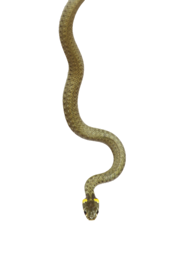

<h1 align="center">  terminal-snake</h1>

## About

Fast-codded snake game for terminal.

### Technologies

* Language: **Python**

## Installing

**Firstly** clone the project.

```git
git clone https://github.com/l1ve4code/terminal-snake.git
```

**Secondly** install necessary libraries

**Thirdly** run from terminal

```cmd
python main.py
```

## Author

* Telegram: **[@live4code](https://t.me/live4code)**
* Email: **steven.marelly@gmail.com**
